<div align="center">

# GeoFigure

### Geophysical Data Visualization Studio

[](https://www.gnu.org/licenses/gpl-3.0)
[](https://www.python.org/downloads/)
[](https://doc.qt.io/qtforpython-6/)
[](https://www.pyqtgraph.org/)
[](https://matplotlib.org/)

A modern desktop application for visualizing and analyzing geophysical dispersion curves, shear-wave velocity (Vs) profiles, and soil layered models -- featuring an interactive PyQtGraph canvas for real-time exploration and a Matplotlib Studio for producing publication-quality figures.

**Author:** Mersad Fathizadeh -- Ph.D. Candidate, University of Arkansas
mersadf@uark.edu | GitHub: [@mersadfathizadeh1995](https://github.com/mersadfathizadeh1995)

</div>

---

## Overview

GeoFigure provides a complete visualization and analysis pipeline for surface wave geophysics. Load experimental and theoretical dispersion curves, overlay ensemble statistics from Geopsy inversion reports, extract Vs/Vp/density profiles with uncertainty quantification, and produce publication-ready figures -- all through an interactive, project-based GUI.

### Key Capabilities

| Module | Description |
|--------|-------------|
| **DC Explorer** | Load and visualize experimental dispersion curves from `.txt`, `.csv`, and Dinver `.target` files with per-point error bars, masking, and interactive styling |
| **DC Compare** | Overlay theoretical ensemble statistics (median, percentile bands, envelope) from Geopsy `.report` files against experimental data |
| **Vs Profile Extraction** | Extract Vs/Vp/density depth profiles from inversion reports with median, percentile bands, sigma_ln, Vs30, and Vs100 statistics |
| **Soil Profile Viewer** | Import deterministic layered models (Geopsy format, CSV, paired step) with multi-property side-by-side rendering (Vs, Vp, Density) |
| **Matplotlib Studio** | Render any sheet as a publication-quality figure with full typography, axis, legend, and export control |
| **Session Persistence** | Project-based workflow with full save/restore of sheets, curves, ensembles, profiles, and layout |

---

## Visual Tour

### Project Setup

Create or select a project directory on launch. GeoFigure organizes all outputs into structured subdirectories for theoretical curves, experimental data, figures, and session state.

<p align="center">
  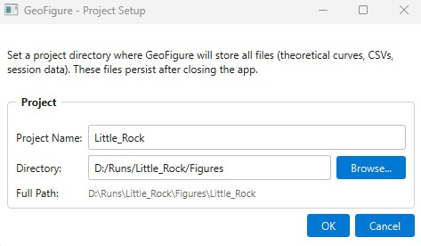
</p>

---

### Main Window

The workspace follows a data-centric layout: a **Data Tree** (left) for managing all loaded items, an interactive **PyQtGraph Canvas** (center) with multi-sheet tabs, and a **Properties Panel** (right) for per-item styling and configuration.

<p align="center">
  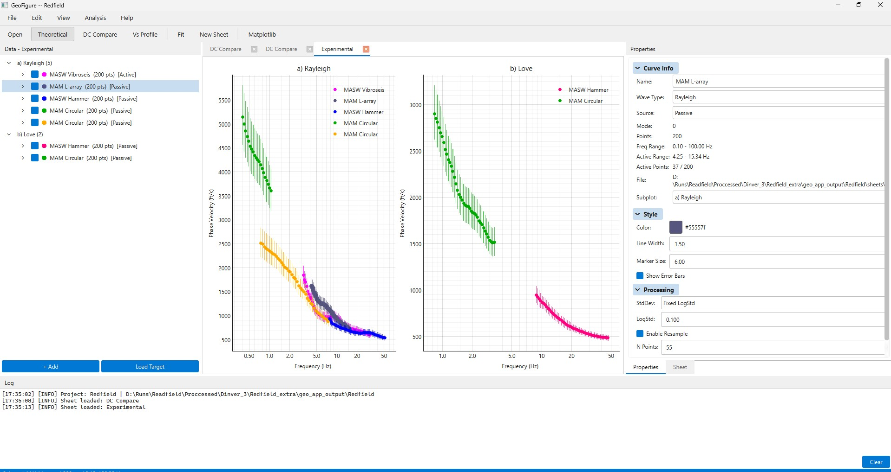
</p>

---

### DC Compare

Load `.report` files to extract theoretical dispersion curves and overlay them against experimental data. Configure selection criteria (best N models or misfit threshold), frequency range, and mode counts.

<p align="center">
  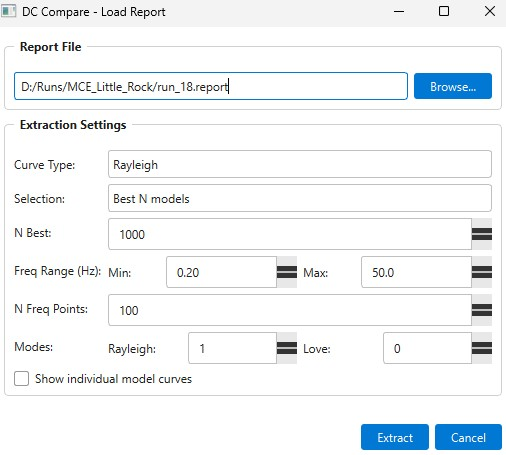
</p>

<p align="center">
  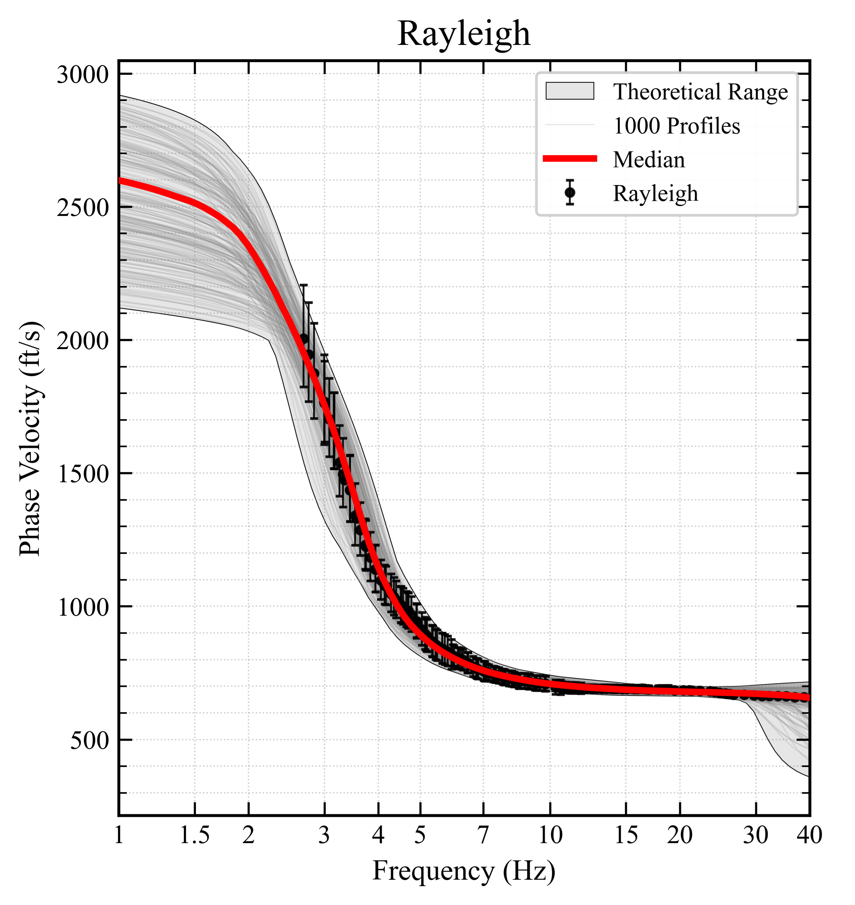
  <br><em>Theoretical ensemble (median, percentile band, envelope) overlaid on experimental dispersion curves -- Rayleigh and Love modes side by side</em>
</p>

<details>
<summary><strong>More Dispersion Curve Outputs (click to expand)</strong></summary>
<br>

<p align="center">
  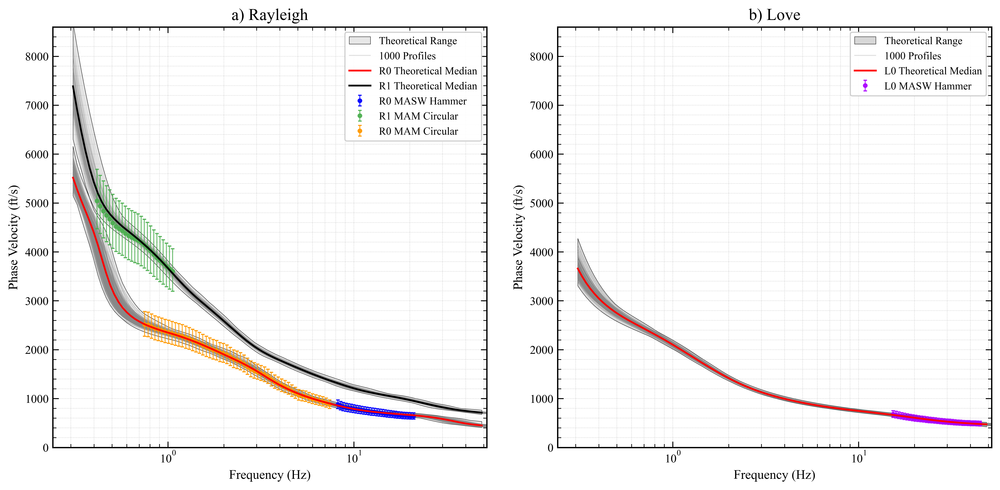
  <br><em>Multi-mode theoretical vs. experimental comparison with error bars and ensemble statistics</em>
</p>

<p align="center">
  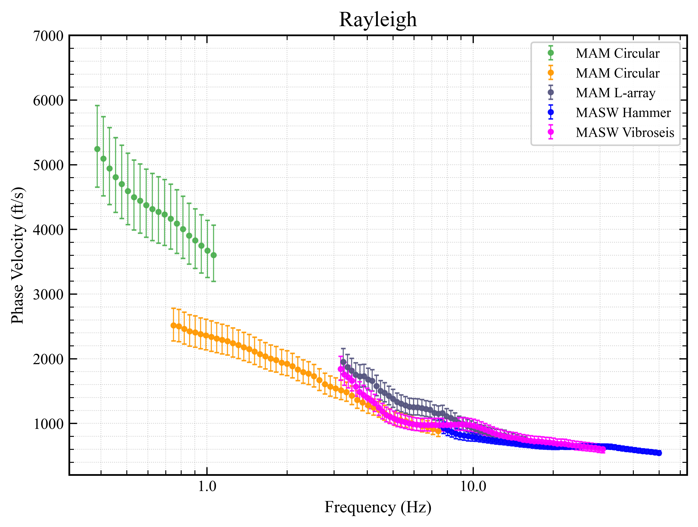
  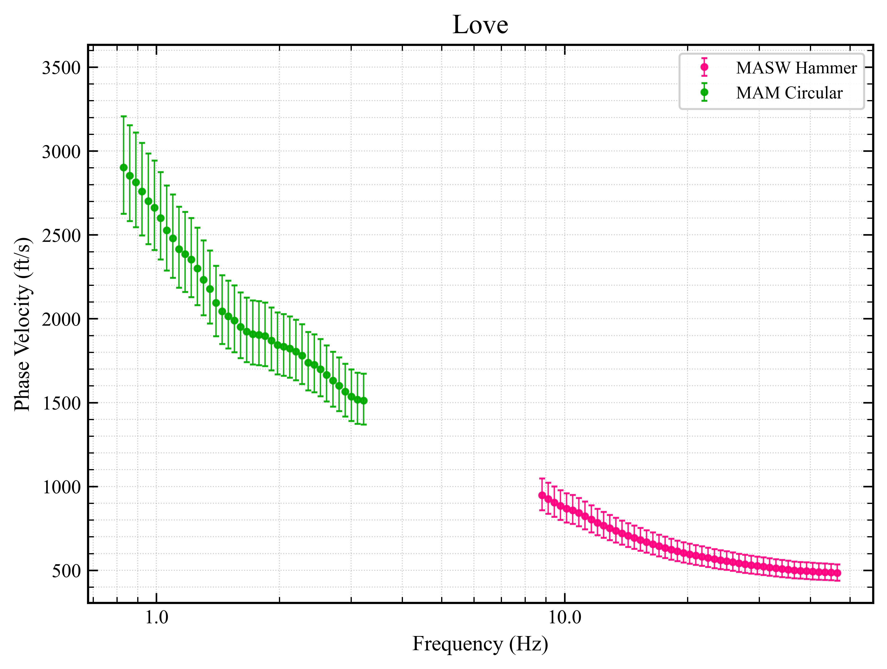
</p>
<p align="center"><em>Rayleigh (left) and Love (right) dispersion curves with multiple modes and error bars</em></p>

</details>

---

### Vs Profile Extraction

Extract shear-wave velocity profiles from Geopsy inversion reports. View the median Vs profile with percentile uncertainty bands, individual model spaghetti plots, sigma_ln distribution, and summary statistics (Vs30, Vs100).

<p align="center">
  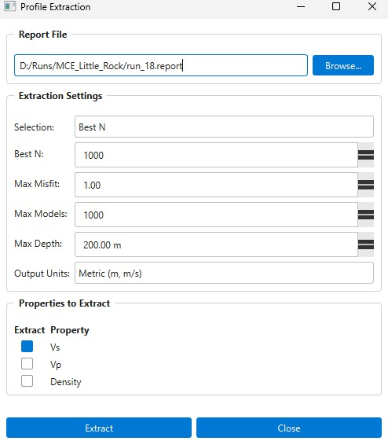
</p>

<p align="center">
  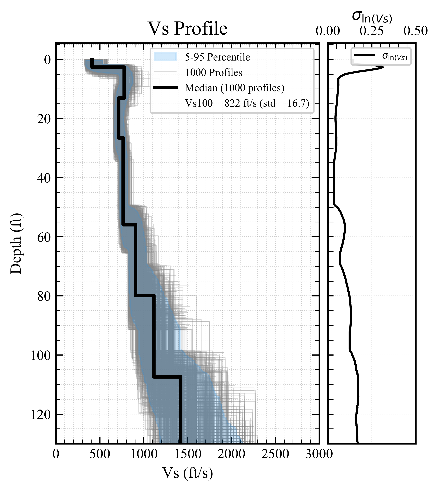
  <br><em>Vs depth profile -- bold median, 16th/84th percentile band, and individual model curves</em>
</p>

<details>
<summary><strong>More Vs Profile Outputs (click to expand)</strong></summary>
<br>

<p align="center">
  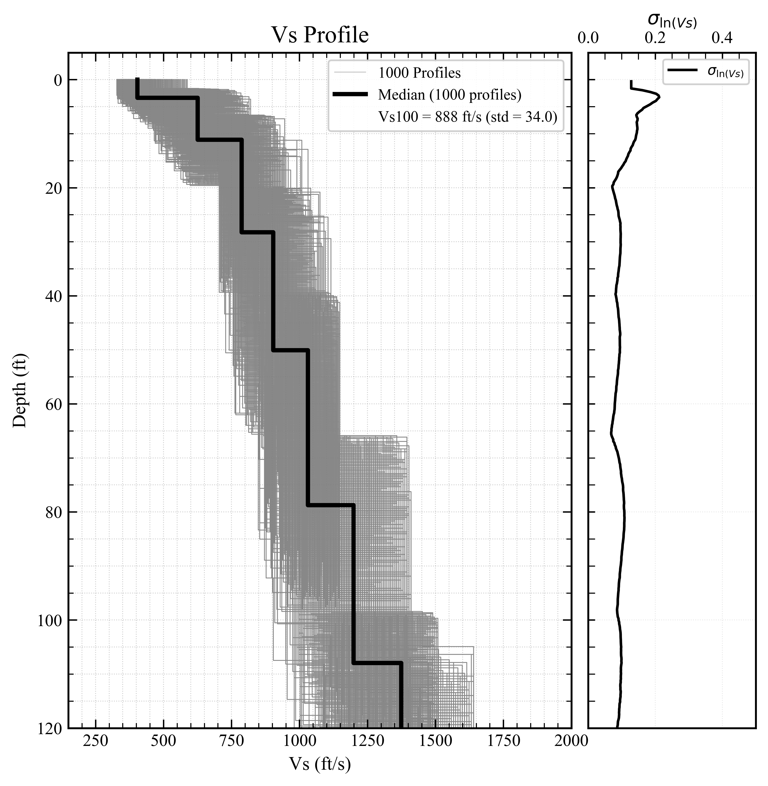
  <br><em>Vs profile to 120 ft depth with ensemble statistics and Vs100 annotation</em>
</p>

<p align="center">
  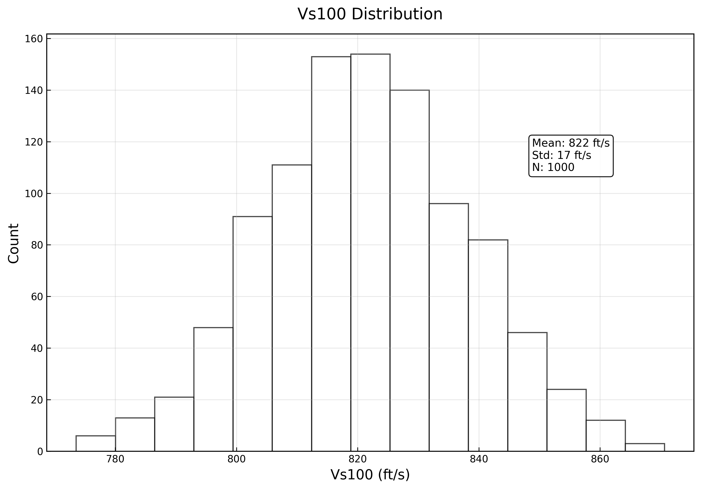
  <br><em>Histogram of Vs100 values from the inversion ensemble</em>
</p>

</details>

---

### Matplotlib Studio

Render the current sheet through Matplotlib with full control over figure size, margins, typography, per-subplot axis configuration, legend placement, and export settings. Built-in presets for Publication, Presentation, Poster, and Compact styles.

<p align="center">
  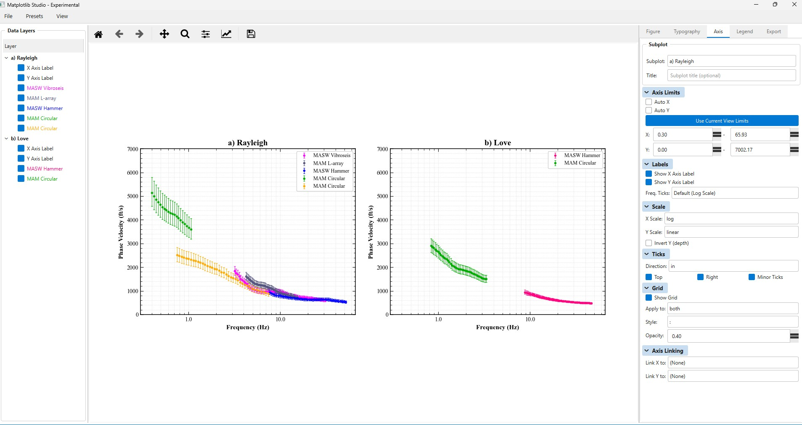
  <br><em>Matplotlib Studio -- real-time preview with typography, axis, legend, and export panels</em>
</p>

---

## Installation

### Prerequisites

- **Python 3.10** or newer
- **pip** (included with Python)

### 1. Clone the Repository

```bash
git clone https://github.com/mersadfathizadeh1995/Geo_figure.git
cd Geo_figure
```

### 2. Create a Virtual Environment (recommended)

```bash
# Windows
python -m venv .venv
.venv\Scripts\activate

# Linux / macOS
python3 -m venv .venv
source .venv/bin/activate
```

### 3. Install Dependencies

```bash
pip install -r requirements.txt
```

Or install the package in editable mode:

```bash
pip install -e .
```

<details>
<summary><strong>Core Dependencies</strong></summary>

| Package | Purpose |
|---------|---------|
| PySide6 | Qt 6 GUI framework |
| NumPy | Array operations and numerical computation |
| SciPy | Interpolation and statistical functions |
| Matplotlib | Publication-quality figure rendering |
| pyqtgraph | Interactive real-time plotting canvas |
| Pandas | Tabular data handling and CSV export |
| openpyxl | Excel file export |

</details>

<details>
<summary><strong>Optional -- Geopsy CLI Tools</strong></summary>

| Tool | Purpose |
|------|---------|
| `gpdcreport` | Extract dispersion curves and profiles from `.report` files |
| `gpdc` | Compute theoretical dispersion curves from layered models |
| `gpprofile` | Extract Vs/Vp/density profiles from inversion results |

These tools are required only for `.report` file processing. Install them from [geopsy.org](https://www.geopsy.org/).

</details>

### 4. Launch the Application

```bash
python -m geo_figure
```

Or use the batch launcher (Windows):

```bash
geo_figure.bat
```

---

## Usage

### GUI Workflow

On launch, a **Project Dialog** prompts you to select or create a project directory. The main window then opens with five integrated panels:

| Panel | Location | Purpose |
|-------|----------|---------|
| **Data Tree** | Left dock | Tree view of all loaded curves, ensembles, and profiles with per-item checkboxes |
| **Plot Canvas** | Center | Interactive PyQtGraph canvas with multi-sheet tabs and configurable subplot grids |
| **Properties** | Right dock | Per-item styling (color, line width, markers), processing settings, and display options |
| **Sheet Settings** | Right tab | Subplot layout, column ratios, legend configuration, and axis linking |
| **Log** | Bottom dock | Timestamped operation log and status messages |

### Quick Workflow

1. **File -- Open Curve File** (`Ctrl+O`) -- load experimental dispersion curves (.txt, .csv, .target)
2. **File -- Open Theoretical DC** -- load Geopsy theoretical dispersion curves
3. **File -- Load Vs Profile** -- import soil profiles from layered model files
4. **Analysis -- DC Compare** -- extract and overlay theoretical ensembles from a `.report` file
5. **Analysis -- Extract Vs Profile** -- compute Vs/Vp/density profiles with statistics
6. **Analysis -- Render to Matplotlib** (`Ctrl+M`) -- open the Studio for publication-quality output
7. **File -- Save Sheet** (`Ctrl+S`) -- persist the full session state

### Supported File Formats

| Format | Extension | Description |
|--------|-----------|-------------|
| Dispersion Text | `.txt` | Tab/space-separated: frequency, slowness/velocity, stddev (auto-detected) |
| Dispersion CSV | `.csv` | Comma-separated dispersion data with optional headers |
| Dinver Target | `.target` | Geopsy/Dinver inversion target files (gzip or uncompressed tar) |
| Geopsy Report | `.report` | Inversion results processed via Geopsy CLI tools |
| Geopsy Layered Model | `.txt` | N-layer format: thickness, Vp, Vs, density (single or multi-model) |
| Paired Step | `.txt` | Value/depth paired format from gpdcreport output |
| Profile CSV | `.csv` | Layer-based or multi-profile CSV with column headers |

---

## Project Structure

```
geo_figure/
+-- __init__.py                # Package metadata and version
+-- __main__.py                # Entry point: python -m geo_figure
+-- app.py                     # Application bootstrap (QApplication setup)
+-- core/
|   +-- models.py              # CurveData, EnsembleData, VsProfileData, SoilProfile, FigureState
|   +-- profile_processing.py  # Vs profile statistics (median, percentiles, Vs30/Vs100)
|   +-- soil_profile_stats.py  # SoilProfileGroup statistics computation
|   +-- subplot_types.py       # Subplot type registry and validation
+-- gui/
|   +-- main_window.py         # Main application window
|   +-- main_window_modules/   # Modular mixins (menus, file I/O, handlers, persistence)
|   +-- theme.py               # Dark and light QSS themes
|   +-- canvas/                # PyQtGraph interactive canvas and sheet tabs
|   +-- dialogs/               # Project setup, settings, DC compare, Vs profile dialogs
|   +-- panels/                # Data tree, properties, sheet settings, log panels
|   +-- studio/                # Matplotlib Studio (renderer, settings, presets, UI panels)
+-- io/
|   +-- curve_reader.py        # Dispersion curve file readers (txt, csv, target, theoretical)
|   +-- report_reader.py       # Geopsy .report file extraction via CLI
|   +-- vs_reader.py           # Vs/Vp/density profile readers (layered models)
|   +-- target_reader.py       # Dinver .target file parser
|   +-- converters.py          # Unit conversions (slowness/velocity, stddev normalization)
|   +-- sheet_persistence.py   # Sheet state serialization / deserialization
|   +-- data_mapper/           # Interactive column-mapping dialog and parser
```

---

## Architecture

GeoFigure follows a **layered, modular architecture** separating data, logic, and presentation:

| Layer | Location | Role |
|-------|----------|------|
| **Core** | `core/` | Data models, statistical processing, subplot type system |
| **I/O** | `io/` | Format-specific readers, unit converters, session persistence, data mapper |
| **Canvas** | `gui/canvas/` | PyQtGraph-based interactive plotting with subplot renderers |
| **Panels** | `gui/panels/` | Data tree, properties editor, sheet configuration, log |
| **Dialogs** | `gui/dialogs/` | Project setup, settings, DC compare, Vs extraction wizards |
| **Studio** | `gui/studio/` | Matplotlib rendering engine, typography/axis/legend panels, presets, export |
| **Main Window** | `gui/main_window*.py` | Application shell with modular mixin architecture |

---

## Contributing

Contributions are welcome. Please open an issue or submit a pull request.

1. Fork the repository
2. Create a feature branch (`git checkout -b feature/my-feature`)
3. Commit your changes (`git commit -m "Add my feature"`)
4. Push to the branch (`git push origin feature/my-feature`)
5. Open a Pull Request

---

## Acknowledgments

- [PySide6](https://doc.qt.io/qtforpython-6/) -- Qt for Python
- [pyqtgraph](https://www.pyqtgraph.org/) -- scientific real-time graphics
- [Matplotlib](https://matplotlib.org/) -- publication-quality plotting
- [Geopsy](https://www.geopsy.org/) -- geophysical analysis tools

---

## Citation

If you use GeoFigure in your research, please cite:

> Fathizadeh, M. (2025). GeoFigure: Geophysical Data Visualization Studio. GitHub repository. https://github.com/mersadfathizadeh1995/Geo_figure

---

## License

Copyright (C) 2025 Mersad Fathizadeh

This program is free software: you can redistribute it and/or modify it under the terms of the **GNU General Public License v3.0** as published by the Free Software Foundation.

See the [LICENSE](LICENSE) file for details.
